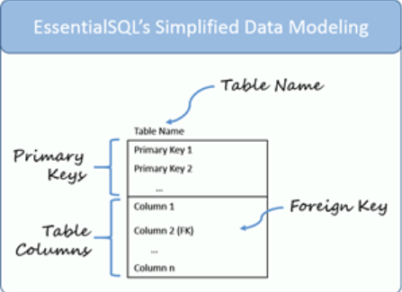
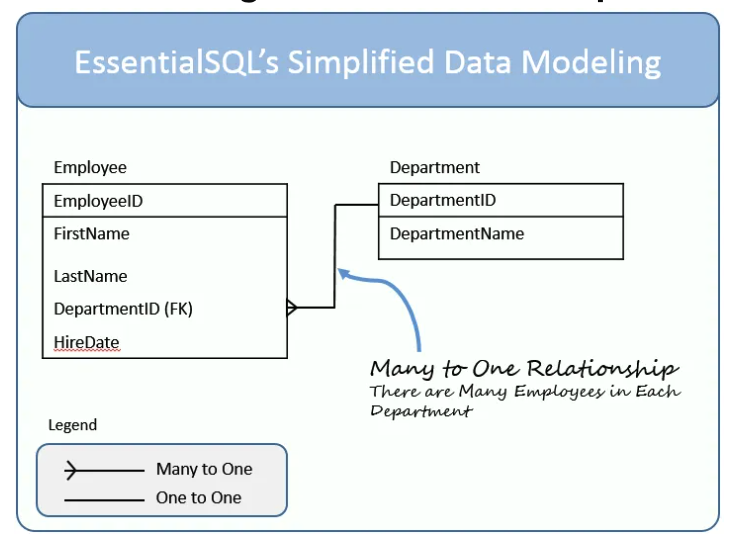

# Readings: Data Modeling - class04 - 401

## Note from the student Rey Mercado to the grader

## Overview

Below you will find some reading material, code samples, and some additional resources that support today’s topic and the upcoming lecture.

Review the Submission Instructions for guidance on completing and submitting this assignment.

## Review, Research, and Discussion

## Preview

Skim the following materials in preparation for the upcoming lecture. Note the following as you browse the material, and be prepared to participate in discussions during lecture

## Reading

### ****[nosql vs sql - thegeekstuff.com](https://www.thegeekstuff.com/2014/01/sql-vs-nosql-db/?utm_source=tuicool)****

SQL also known as relational databases (RDBMS)
SQL examples: 
  - Popular Examples:
    - MySQL Community Edition, MS-SQL Server Express Edition, Oracle Express Edition.
  - Additional examples:
    - MySql, Oracle, Sqlite, Postgres and MS-SQL. NoSQL database examples: MongoDB, BigTable, Redis, RavenDb, Cassandra, Hbase, Neo4j and CouchDb

NoSQL are known as non-relation databases. 

NoSQL examples: MongoDB, CouchDB, Redis.

### ****[sql modeling techniques -](https://www.essentialsql.com/get-ready-to-learn-sql-7-simplified-data-modeling/)****

#### A method to model a relational database

- The `Table Name`, which is located at the top of the table.
- The `Primary Keys`.  Remember the primary keys uniquely identify each row in a table.  A table typically has one primary key, but can have more.  When the key has more than one column, it is called a compound key.
- `Table Columns` – There can be one or more table columns.  To keep the diagrams simple, I don’t show the data types.  I may introduce those later when we focus on more comprehensive modeling.
- `Foreign Key` – This is a column or set of columns which match a primary key in another table. The match between foreign keys and primary key is what "glues" the database together.

#### Data Modeling - Table Relationships

We connect lines between tables to show relaationships. When there are many employees in one department, we call that a `many-to-one relationship`

## Exercises:
- What is the difference between one-to-one relationship and a many-to-one relationship?
- What is a Foreign Key?  How do you define one?
- What is the difference between a primary key and a compound primary key?

## Videos

### ****[sql vs nosql](https://www.youtube.com/watch?v=ZS_kXvOeQ5Y)****

placeholder 

 

## Bookmark and Review

### [sequelize api - sequelize.org](https://sequelize.org/master/)

### [express docs](https://expressjs.com/en/4x/api.html)

### [http status codes](https://www.restapitutorial.com/httpstatuscodes.html)

### [supertest](https://github.com/visionmedia/supertest)

----

# Readings: Data Modeling

Below you will find some reading material, code samples, and some additional resources that support today's topic and the upcoming lecture.

Review the Submission Instructions for guidance on completing and submitting this assignment.

## Review, Research, and Discussion

In your reading notes page for this class, provide answers to the following prompts. Cite any external sources

1. Name 3 advantages to Test Driven Development

1. In what case would you need to use `beforeEach()` or `afterEach()` in a test suite?
1. What is one downside of Test Driven Development
1. What's the primary difference between ES6 Classes and Constructor/Prototype Classes?
1. Why REST?

### Document the following Vocabulary Terms

| Term                              |
| --------------------------------- |
| functional programming            |
| object-oriented programming (OOP) |
| class                             |
| `super`                           |
| `this`                            |
| Test Driven Development (TDD)     |
| Jest                              |
| Continuous Integration (CI)       |
| REST                              |
| Data Model                        |

## Preview

Skim the following materials in preparation for the upcoming lecture. Note the following as you browse the material, and be prepared to participate in discussions during lecture

1. Which 3 things had you heard about previously and now have better clarity on?
1. Which 3 things are you hoping to learn more about in the upcoming lecture/demo?
1. What are you most excited about trying to implement or see how it works?

### Preparation Materials

- [sql vs nosql](https://www.youtube.com/watch?v=ZS_kXvOeQ5Y){:target="_blank"}(Video)

- [nosql vs sql](https://www.thegeekstuff.com/2014/01/sql-vs-nosql-db/?utm_source=tuicool){:target="_blank"}

- [sql modeling techniques](https://www.essentialsql.com/get-ready-to-learn-sql-7-simplified-data-modeling/){:target="_blank"}

## Bookmark

- [sequelize api](https://sequelize.org/master/){:target="_blank"}